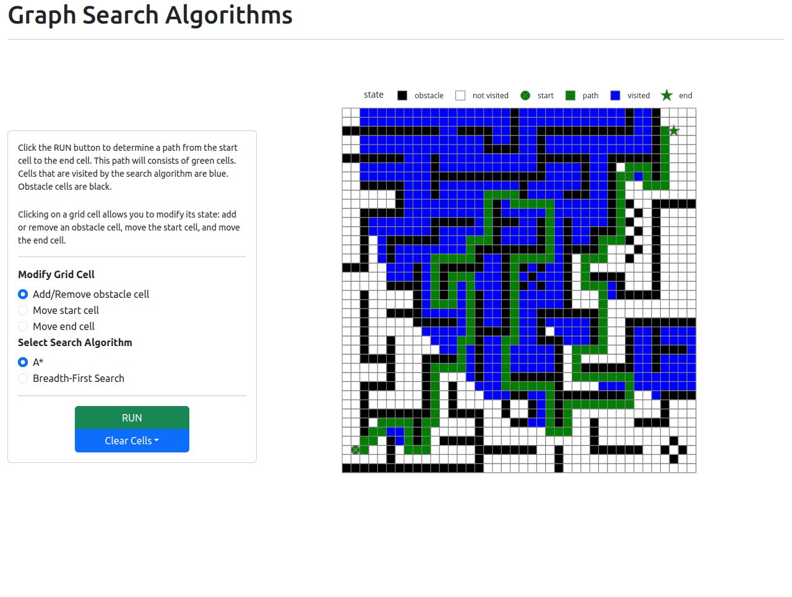

[![MIT License][license-shield]][license-url]
[![LinkedIn][linkedin-shield]][linkedin-url]

<div align="center">
    <h3 align="center">Graph Search Visualizer</h3>
</div>

<details>
  <summary>Table of Contents</summary>
  <ol>
    <li><a href="#about-the-project">About The Project</a></li>
    <li><a href="#docker-deployment">Docker Deployment</a></li>
    <li><a href="#built-with">Built With</a></li>
  </ol>
</details>

## About The Project

<br/>
<div align="center">
    
</div>
<br/>

This __Plotly Dash__ web application visualizes the path and the nodes visited by two graph search algorithms:
__breadth-first search__ and __A*__. The grid is initialized with obstacles forming a maze. The obstacle cells can be
added or removed by clicking on the grid cells. Moreover, the locations of the start and end cells can also be moved.


## Docker Deployment

```bash
docker build -t path-finding:latest .
docker run -it --rm -p 8050:8050 path-finding:latest
```

<!-- MARKDOWN LINKS & IMAGES -->
<!-- https://www.markdownguide.org/basic-syntax/#reference-style-links -->

Open the application at `localhost:8050`.

## Built With

* [Plotly Dash][dash-url]

[license-url]: LICENSE.txt

[linkedin-url]: https://www.linkedin.com/in/faerlin-pulido/

[dash-url]: https://dash.plotly.com

[license-shield]: https://img.shields.io/github/license/othneildrew/Best-README-Template.svg?style=for-the-badge

[linkedin-shield]: https://img.shields.io/badge/-LinkedIn-black.svg?style=for-the-badge&logo=linkedin&colorB=555